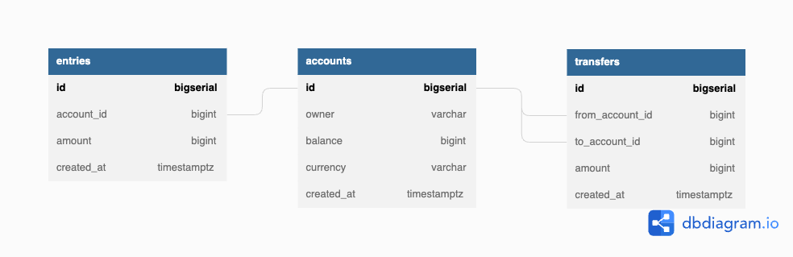

# Simple Bank
From backend class at [TECH SCHOOL](https://www.youtube.com/playlist?list=PLy_6D98if3ULEtXtNSY_2qN21VCKgoQAE)

## Dependencies
- docker
- [golang-migrate](https://github.com/golang-migrate/migrate)
- [sqlc](https://github.com/kyleconroy/sqlc)

## Database schema
Created with [dbdiagram.io](https://dbdiagram.io/d/630bb78af1a9b01b0ffa13a3)

